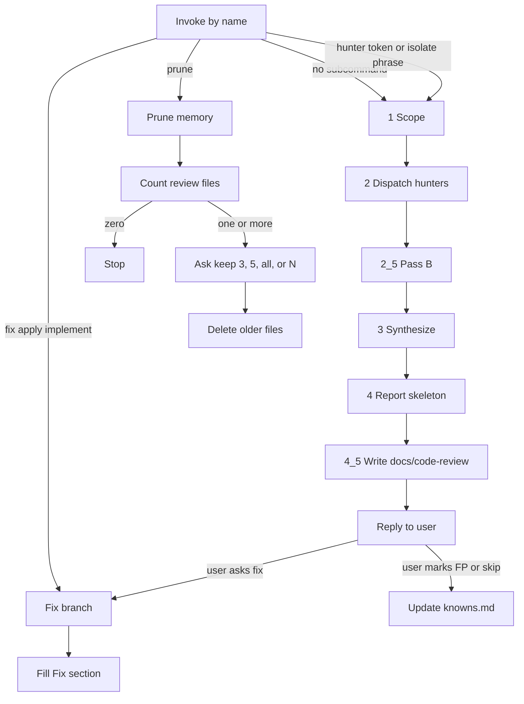

# Code Review Plus

Review a PR or diff across correctness, security, architecture, quality, and performance. Invoke the skill by name. Name one hunter (`/code-review-plus quality`) to run that pass only. If you want a deep security review instead, use [`/deep-security-review`](../deep-security-review/). Do not run both Security passes on the same scope.

## Commands

| Command                         | When                                                                                 |
| ------------------------------- | ------------------------------------------------------------------------------------ |
| `/code-review-plus`             | Review the current diff, branch, or named files (all hunters the tier requires)      |
| `/code-review-plus <hunter>`    | One hunter (`correctness`, `security`, `architecture`, `quality`, `performance`)     |
| `/code-review-plus fix`         | Apply kept findings from the last report (aliases: `apply`, `implement`)             |
| `/code-review-plus prune`       | Drop old files under `docs/code-review/` (count first, then choose how many to keep) |

First reserved token (`fix` / `apply` / `implement` / `prune`) wins. Isolation: a hunter name, or `code quality` / `page performance` / `only` + hunter. Two hunter names without `only` stay a full review.

## How it works

The orchestrator scopes the change (intent, size, dispatch tier, stack tags, concrete `Pipelines` names) and, when they exist, reads `docs/code-review/knowns.md` and the latest review file. Known false positives stay closed unless the cited path changed. A prior isolated review covers only the hunters it lists.

It then runs each name in `Pipelines` (up to five in parallel, or one hunter when the invocation named one). Each hunter gets one perspective and at most one stack shape (web, API, language, or LLM), picked by priority. A `web`+`api`+`ts` PR gets shapes. Quality hunts nesting, speculative abstraction (YAGNI), and the project's complexity rules when they are configured. Quality also reads test-quality rules when the diff includes tests.

When the hunters return, the orchestrator verifies every candidate against the code (Pass B), may dispatch one P0 verifier, synthesizes severity, and fills the report skeleton. It writes memory under `docs/code-review/` in the reviewed repo, then replies with the report.

## Flow

## Review memory

These files belong in the reviewed repo, not in this skill folder. The skill does not commit them.

- `docs/code-review/YYYY-MM-DD-HH-MM.md`: findings from that review. `/code-review-plus fix` adds a `## Fix` section on first apply.
- `docs/code-review/knowns.md`: created when you mark a finding as a false positive or out of scope

The next review reads those files. Fix loads findings from this conversation or from that memory, reads `## Fix` for already-closed items, and updates the same file. `/code-review-plus prune` counts timestamped review files first, then asks whether to keep the last 3, the last 5, delete all, or keep a number you type. `knowns.md` stays.

## Files

- [`SKILL.md`](SKILL.md): router (review vs fix vs prune; hunter override on review)
- [`references/phases/`](references/phases/): scope, dispatch, verify, synthesize, persist, knowns, fix, prune
- [`references/perspectives/`](references/perspectives/): the five hunters
- [`references/shapes/`](references/shapes/): optional stack overlays
- [`references/test-quality.md`](references/test-quality.md): tests already in the diff (Quality)
- [`references/complexity.md`](references/complexity.md): cyclomatic vs cognitive load, YAGNI (orchestrator, Pass B)
- [`references/templates/report.md`](references/templates/report.md): report skeleton
