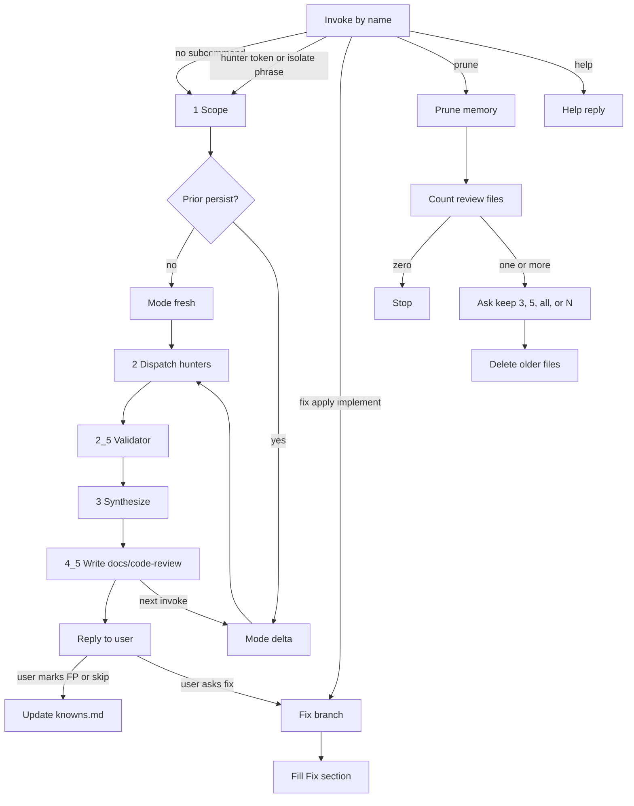

# Code Review Plus

Review a PR or diff for bugs, security, and code quality. Invoke the skill by name. Name one hunter (`/code-review-plus quality`) to run that pass only. If you want a deep security review instead, use [`/deep-security-review`](../deep-security-review/). Do not run both Security passes on the same scope.

## Commands

| Command                         | When                                                                                 |
| ------------------------------- | ------------------------------------------------------------------------------------ |
| `/code-review-plus`             | Review the current diff, branch, or named files (hunters the tier requires)          |
| `/code-review-plus <hunter>`    | One hunter (`correctness`, `security`, `architecture`, `quality`, `performance`)     |
| `/code-review-plus fix`         | Apply P0, P1, and vuln; then leftover IDs (`fix all` or `fix 2,5`)                   |
| `/code-review-plus fix all`     | Apply every P0–P3 finding (nits included)                                            |
| `/code-review-plus fix 2,3,6`   | Apply those Findings IDs (spaces also work)                                          |
| `/code-review-plus prune`       | Drop old files under `docs/code-review/` (count first, then choose how many to keep) |
| `/code-review-plus help`        | Explain how this skill works                                                         |

First reserved token (`fix` / `apply` / `implement` / `prune` / `help`) wins. After `fix`, remainder is `all`, finding IDs, or empty (default). Isolation: a hunter name, or `code quality` / `page performance` / `only` + hunter. Two hunter names without `only` stay a full review.

## How it works

The orchestrator scopes the change (intent, size, dispatch tier, stack tags, concrete `Pipelines` names) and, when they exist, reads `docs/code-review/knowns.md` and the latest review file. Known false positives stay closed unless the cited path changed. A prior isolated review covers only the hunters it lists. A prior HEAD sets **delta**: this pass hunts hunks since that commit.

Default pipelines: **trivial** Correctness + Quality (Security if the diff touches a sensitive surface); **normal** Correctness + Security + Quality; **large/sensitive** those three plus Architecture. Performance runs only when isolated.

Each hunter gets one perspective and at most one stack shape, picked by priority. Security and Quality do not attach `web`/`api` shapes (the Security perspective already hunts that surface). The Quality hunter reads `make-code` when that skill is in the environment; otherwise it reads the built-in Floor in `quality.md` and the report says so. Quality also reads test-quality rules when the diff includes tests.

When the hunters return, the orchestrator validates every candidate against the code (Pass B), synthesizes severity, and puts every kept finding in the report. It writes memory under `docs/code-review/` in the reviewed repo, then replies with the report.

## Flow

## Review memory

These files belong in the reviewed repo, not in this skill folder. The skill does not commit them.

- `docs/code-review/YYYY-MM-DD-HH-MM.md`: findings from that review. `/code-review-plus fix` adds a `## Fix` section on first apply.
- `docs/code-review/knowns.md`: created when you mark a finding as a false positive or out of scope

The next review reads those files and is **delta** when a prior HEAD exists. Fix loads findings from this conversation or from that memory, reads `## Fix` for already-closed items, and updates the same file. Bare `fix` applies P0, P1, and vuln, then names leftover IDs. Any `fix` reads `make-code` when that skill is in the environment (write / refactor per finding; Clean fix otherwise). After fix, the next `/code-review-plus` is delta (closed paths plus new P0/P1). `/code-review-plus prune` counts timestamped review files first, then asks whether to keep the last 3, the last 5, delete all, or keep a number you type. `knowns.md` stays.

## Files

- [`SKILL.md`](SKILL.md): router (review vs fix vs prune vs help; hunter override on review)
- [`references/phases/`](references/phases/): scope, dispatch, verify, synthesize, persist, knowns, fix, prune, help
- [`references/perspectives/`](references/perspectives/): the five hunters (`quality.md` is the Floor fallback)
- [`references/shapes/`](references/shapes/): optional stack overlays
- [`references/test-quality.md`](references/test-quality.md): tests already in the diff (Quality)
- [`references/complexity.md`](references/complexity.md): cyclomatic vs cognitive load, YAGNI, CC Floor cap **20** (orchestrator, Pass B)
- [`references/templates/report.md`](references/templates/report.md): report skeleton
