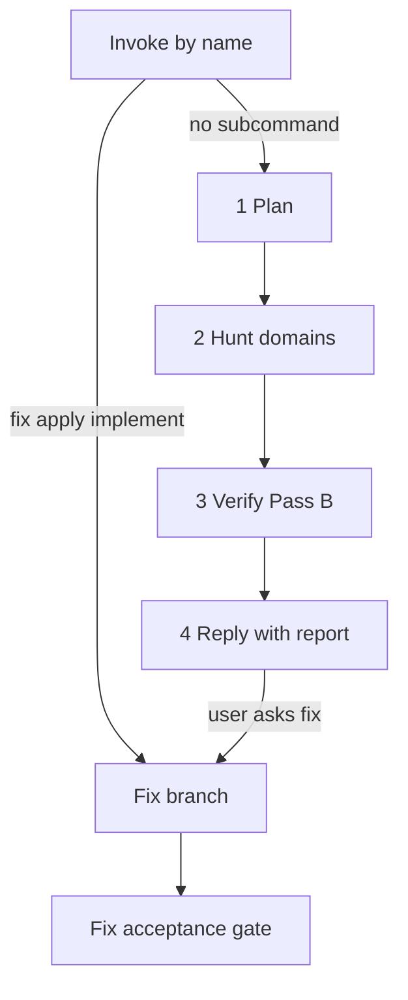

# Deep Security Review

Security-first review of assembled code: AuthZ, tenant isolation, injection, secrets, infra, and LLM/tool chains. Invoke by name. Findings are P0–P3.

## Commands

| Command                            | When                                                        |
| ---------------------------------- | ----------------------------------------------------------- |
| `/deep-security-review`            | Review: threat model, domain hunts, verify, report          |
| `/deep-security-review fix`        | Apply P0 and P1; then leftover IDs (`fix all` or `fix 2,5`) |
| `/deep-security-review fix all`    | Apply every P0–P3 finding (hardening included)              |
| `/deep-security-review fix 2,3,6`  | Apply those Findings IDs (spaces also work)                 |

The first reserved token (`fix` / `apply` / `implement`) wins. After `fix`, the remainder is `all`, finding IDs, or empty (the default: P0 and P1).

## How it works

The orchestrator builds a threat model (assets, actors, entry points, trust boundaries, abuse goals, auth model, hotspots, bypasses) and tags the stack. It always dispatches AuthZ, Injection, Secrets, and Infra. BusinessLLM joins when the surface includes LLM tools, RAG, MCP, or payments.

Each hunter loads one domain file and at most one shape, then hunts in the code. The lists in those files are a **floor**: cover them, then report other in-domain issues that have an exploit path today. `likely` is allowed at hunt time. Without a subagent, domains run in series and the orchestrator restates a short carry list between them.

When the hunters return, the orchestrator re-reads cited code (Pass B), drops false positives, and assigns P0–P3. P0 and P1 require **proven**. Hardening is P2 in the overview table. The report uses the same skeleton as `code-review-plus` (Review Summary, six-column Overview, Verdict), plus Threat Model and Verification Gaps.

Fix needs a report in this conversation or an explicit finding list. Any `fix` reads `make-code` when that skill is in the environment (write or refactor per finding; Clean fix otherwise). A finding is closed when the exploit path is gone and `intended_behavior` still holds.

## Flow

## Relation to `code-review-plus`

Both skills are user-invoked. `/code-review-plus` always uses its own Security hunter. Use this skill when security is the main goal, or after a `code-review-plus` report that suggests `/deep-security-review`. Leave `code-review-plus` unstarted. If this conversation already has a CRP report, this report omits the CRP suggestion line.

## Limitations

Semantic review of assembled code. A clean SAST or SCA scan is not a ship decision. This is not a penetration test. Runtime claims need logs, deployed config, or test access before definitive language.

Secrets appear as `file:line` plus type. Values stay redacted.

## Files

- [`SKILL.md`](SKILL.md): router (review vs fix / all / ids)
- [`references/phases/`](references/phases/): plan, hunt, verify-and-synthesize, fix
- [`references/domains/`](references/domains/): AuthZ, Injection, Secrets, Infra, BusinessLLM
- [`references/shapes/`](references/shapes/): optional stack overlays (at most one per hunter)
- [`references/examples/kept-vs-dropped.md`](references/examples/kept-vs-dropped.md): confirmation gates and false-positive cases (orchestrator)
- [`references/templates/report.md`](references/templates/report.md): report skeleton
- [`references/optional/owasp-map.md`](references/optional/owasp-map.md): OWASP Top 10:2025 map when requested
