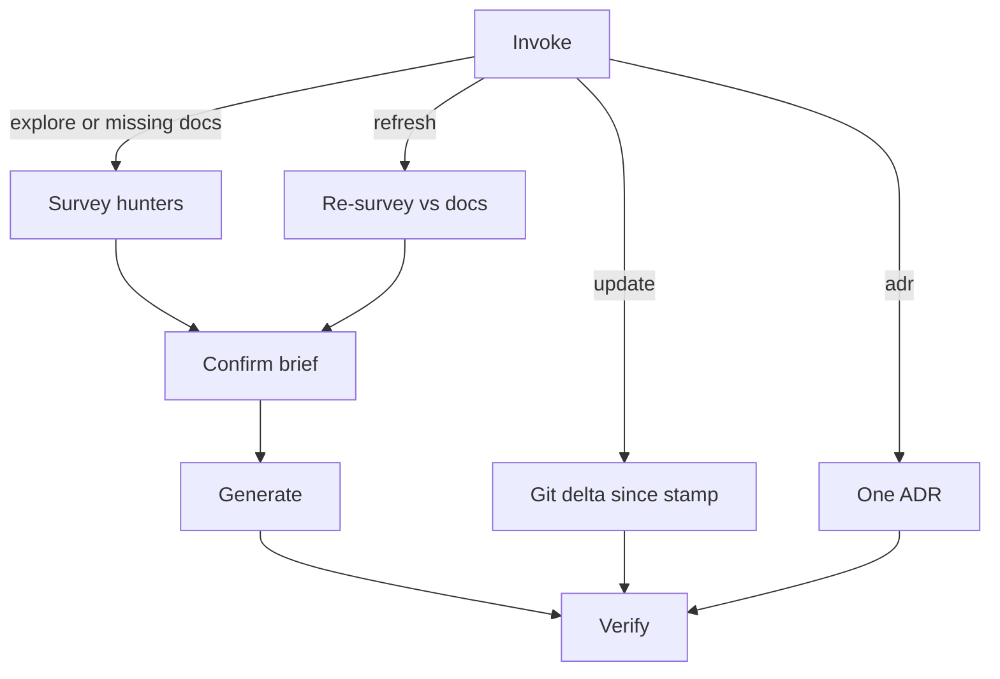

# make-docs

Writes architecture docs (how the system is structured) and behavioral specs (what it does) under `docs/`. Specs name observable outcomes an agent can implement or verify.

Works for services, CLIs, libraries, workers, and monorepos.

## Commands

| Command | When |
| ---------- | ---- |
| `/make-docs explore` | Existing codebase: survey, confirm, generate the suite |
| `/make-docs update` | Sync docs with commits since `> Updated on` in `docs/README.md` |
| `/make-docs refresh` | Re-survey the current tree against existing `docs/` and rewrite what is stale |
| `/make-docs adr` | Record one architecture decision |

`update` follows git since the stamp. `refresh` re-reads the current tree. ADRs stay on refresh unless the code contradicts them.

## How it works

The orchestrator surveys the repo with up to three read-only hunters (structure, behavior, voice). It stops and asks what it understood, whether that is correct, and numbered questions for anything it did not understand. It writes `docs/` only after that gate.

Hunters collect evidence. They leave writing to the orchestrator. The suite uses one language, taken from existing docs unless you name another. Each claim cites a path, an observable command, or a config. Skip a section the survey did not earn, and do not explain that omission in the files.

One topic per heading. Put commands in backticks. Stop heading depth at `h3`. Architecture names units and durable entry points. Skip a dump of source files. Design history belongs in ADRs.

If the repo already has an always-on instruction file (`AGENTS.md`, or the one always-on file present), generate adds one line that says when to read `docs/README.md`. It does not rewrite the rest of that file or create `AGENTS.md`.

## Flow



## Output

```text
docs/
  README.md
  architecture/
    architecture.md
    domains/          # glossary, api (if any), constraints
    decisions/        # ADRs
    patterns.md
  specs/
    <domain>.md       # requirements + Given/When/Then scenarios
```

Small projects get README, architecture, and decisions. Larger ones earn the full set. Cut sections the survey did not earn.

## Files

- [`SKILL.md`](SKILL.md): router (explore / update / refresh / adr)
- [`references/phases/`](references/phases/): survey, confirm, generate, verify, update, refresh, adr
- [`references/hunters/`](references/hunters/): structure, behavior, voice
- [`references/language.md`](references/language.md): language lock and BCP 14 keywords
- [`references/anti-slop.md`](references/anti-slop.md): generic writing tells
- [`references/examples/generic-vs-earned.md`](references/examples/generic-vs-earned.md): drop vs keep
- [`references/template-*.md`](references/): one template per doc type

## Out of scope (default)

Data model, observability, CI/CD. If the survey finds them, it asks. Otherwise those files are omitted. Do not write instruction-file policy. The exception is one when-to-read pointer to `docs/README.md` on an existing canonical always-on file.
