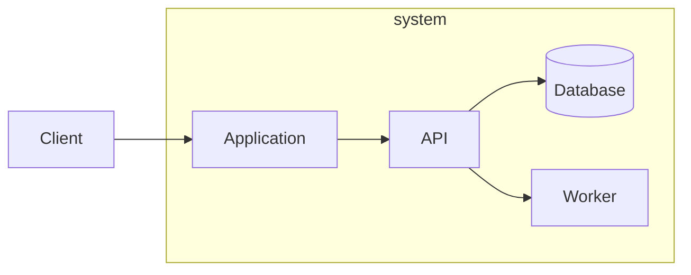

# Architecture

Example rows are not defaults. Replace every placeholder from evidence, or cut the row or section. Draw what the code earns; cut the rest.

## Overview

**Purpose:** {what the system does in one sentence, from this repo}
**Stack:** {languages, frameworks, runtimes named in manifests}
**Entry points:** {CLI, HTTP server, worker, library API; cite paths}

## Structural views

> C4 context (system + actors + external systems), container (separately deployable units), and component (only where internals are load-bearing).
> Code is the source of truth. Diagrams summarize; they do not invent.
> Draw each earned view as a Mermaid graph. The graph below is a shape: replace nodes with units from this tree, or cut the view.

## Dependency rule

> Only when the codebase uses layered architecture with dependency inversion (Clean/Hexagonal). Otherwise cut this entire section.

Dependencies point inward toward the domain. The seam sits between adapters and use cases (dependency inversion).

- Domain → depends on nothing inward
- Use cases → depend on domain ports
- Adapters → implement ports, depend outward on drivers and frameworks
- Frameworks → outermost

## Runtime view

> Key flows as Mermaid sequence diagrams. Trace the full round-trip for each load-bearing path (request, job, event, command). Cut if survey earned no flow.

## Deployment view

> Where containers and processes run. Mermaid graph: hosts, networks, stores, and how artifacts reach production. Cut if deploy is unknown.

## State

**Owned state:** {what this system persists or caches; cite path}
**External state:** {what it reads from other systems; cite path}
**Ephemeral state:** {in-memory, session, queue buffers}
**Synchronization:** {how consistency is maintained across boundaries, or cut}

## Auth

> Cut if the system has no authentication or authorization.

**Mechanism:** {tokens | sessions | mTLS | API keys | IAM roles; from code}
**Flow:** {how identity is established and checked; credential lifecycle}
